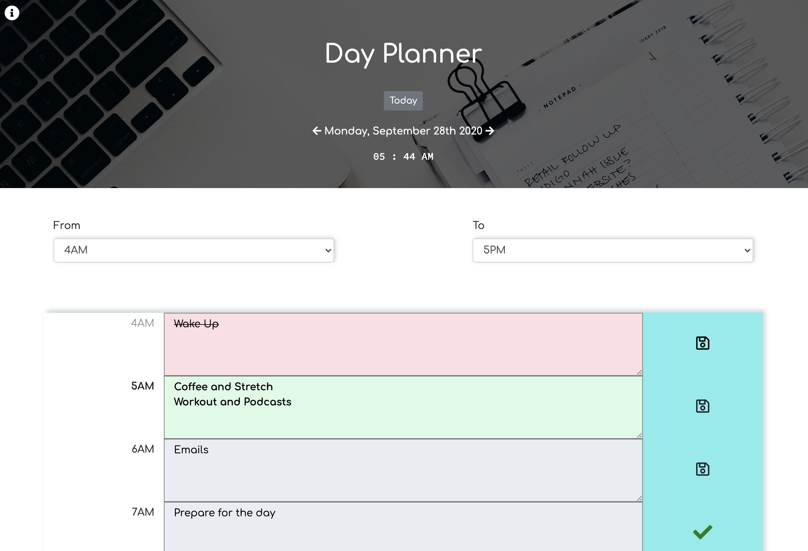
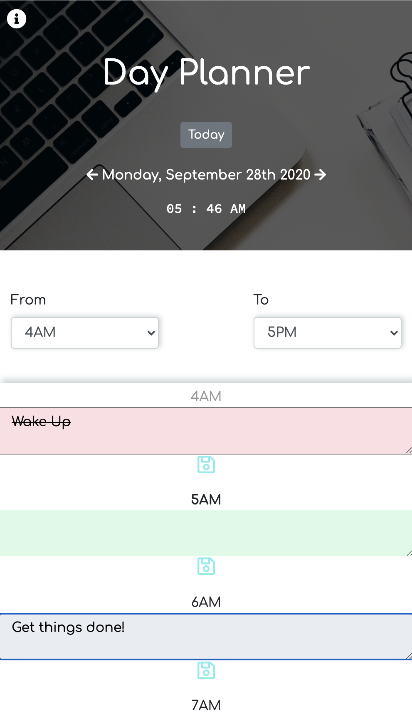

# Day Planner Calendar App

### Deployed Application 

[Day Planner](https://mhans003.github.io/calendarapp/)

### Description 

This program is a browser-based calendar application that allows a user to view, edit, and save upcoming events. 

The program initiates with the default time slots and loads events that are already saved in the user's browser local storage to the appropriate date/time. The user is then allowed to navigate through previous and upcoming days as well as chosen time slots throughout the 24-hour day. When the user changes the date or time slot preferences, the page dynamically adjusts to reflect the displayed date/times and color-codes past, present, and future events. 

When the user makes a change to a time slot by adding, editing, or deleting the text in an event, the corresponding save button can be pressed for that time slot in order to allow the event to persist in the browser's local storage.  

### Features

* Moment.js utilized to access current time and date. 
* Responsive to screen sizes across devices. 
* Incorporates Bootstrap utilities including container, modal, buttons, and forms. 
* Demonstrates the use of the browser's local storage utilizing localStorage and JSON methods. 
* Font Awesome icons support a more satisfying layout. 
* CSS animations produce a more engaging experience. 
* Dynamically-produced elements allow for a cleaner HTML homepage. 

### License 

Licensed under the [MIT License](./LICENSE.txt).